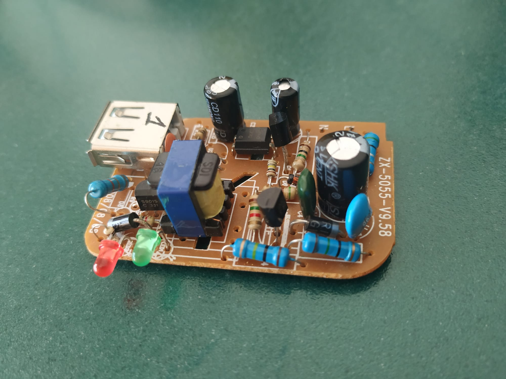

# Rediseño de un cargador USB
## Diseño original

## Pasos a seguir
Para el rediseño de este cargador se van a seguir los siguientes pasos:
- [ ] Extracción del esquemático original
- [ ] Mejoras, si las hubiera, en el diseño
- [ ] Diseño de la nueva PCB
